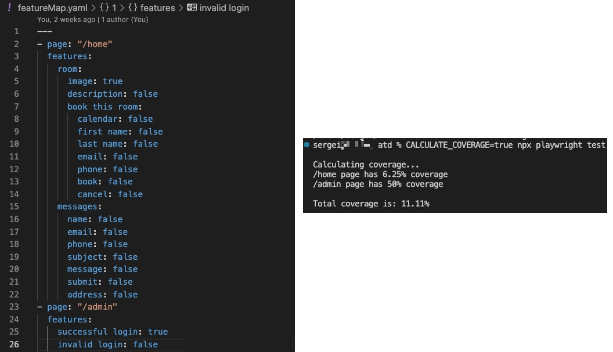

# Agile Testing Days 2023 
## Unlimited Potential In Automation by Sergei Gapanovich 

### Problem 1: UI Automation Coverage
Files to explore to understand how the functionality work:
- ./featureMap.yaml
  - This is where you keep track of your features, user stories, test cases, or whatever you choose to track your coverage. I use the term "coverage" but the idea is that you can also use this logic for your documentation. It's a YAML file, which makes it very easy to organize features and test scenarios. If you're not familiar with YAML and want to learn more, please visit https://www.redhat.com/en/topics/automation/what-is-yaml.
- ./global-setup.ts
  - If you want to calculate coverage and see the results in the terminal before running any tests, you need to pass `CALCULATE_COVERAGE=true` before the `npx playwright test` command. The ./featureMap.yaml file will be read, converted to JSON, and then passed to the `calculateUICoverage()` function.
- ./helpers/calculateUICoverage.ts
  - The "magic" of actually calculating coverage happens in this file. The code could be improved, but I've left it this way to make it easier to read and understand the logic.

--------

### Problem 2: Writing Expects Manually
Files to explore to understand how the functionality works:
- ./helpers/createAssertions.ts
  - You call the `createAssertions()` function and pass a response body. Assertions will be printed to the terminal, and all you'll have to do is copy and paste them into your test. The function can be modified to better fit your tests. For example, I have a custom expect: when a date is returned in the response body, the function generates `expect(body.created_at).toBeValidDate()`. You can learn more about creating custom expects in Playwright here: https://playwrightsolutions.com/creating-custom-expects-in-playwright-how-to-write-your-own-assertions.

--------

### Problem 3: Custom Messages (Warnings)
Files to explore to understand how the functionality works:
- ./helpers/warnings.ts
  - You call the `warnings()` function and pass a message you would like to be printed to the console after all tests are finished running.
- ./warnings.log
  - This file contains messages to be printed at the end of the run. There won't be a warnings file if no messages are added during test execution.
- ./global-setup.ts
  - The warnings file is deleted before each run so that a new one can be created to append our messages.
- ./global-teardown.ts
  - The warnings file is read, and all messages are printed to the console.

--------

### Problem 4: Mocking with Real API Responses

Mocking is awesome, but the way many people approach mocking API responses to test UI is not for me. I don't want to maintain hardcoded file(s). Playwright makes it super easy to mock API responses (see the official docs here: https://playwright.dev/docs/api/class-route#route-fulfill). My approach to mocking is as follows: I first make an actual API call to my servers to get the real-time structure of the object, then modify it as needed. By using Playwright's `route.fulfill`, I pass the modified JSON. At this point, all I need to do is ensure that the UI displays what I expected.

Files to explore to understand how the functionality works:
- ./tests/uiTest.spec.ts

--------

### Playwright resources
Playwright official docs: https://playwright.dev/docs/intro (they are amazing)

Another resource I highly recommend for those who work with or want to work with Playwright: https://playwrightsolutions.com

### Feedback
I would be happy to receive any feedback, so please feel free to connect or message me on LinkedIn: https://www.linkedin.com/in/sgapanovich/